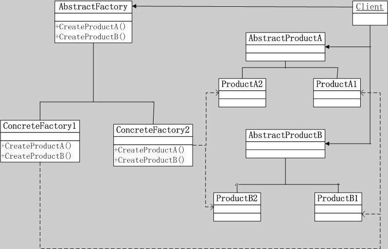
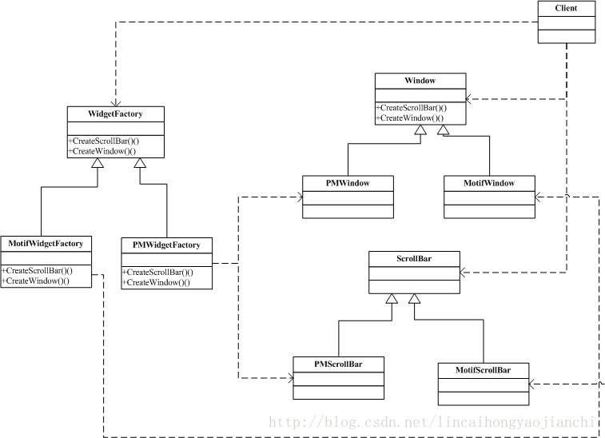
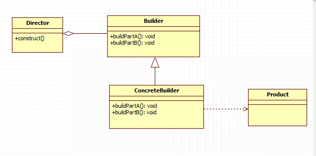
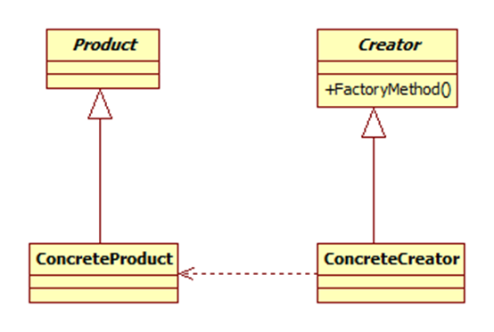
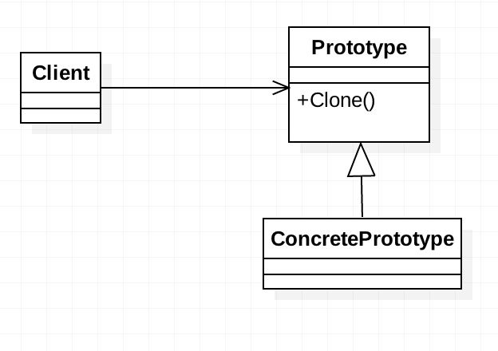
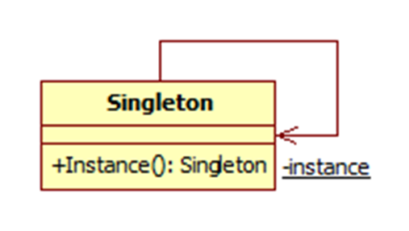

# Design Pattern

## Creational Pattern 創建型模式

### 1. Abstract Factory 抽象工廠模式


- 核心：客戶端透過抽象工廠接口創建產品
- 實現要點：
1. 面對抽象工廠接口編程，每個產品組合組成一個工廠類，一個產品對應工廠的一個創建方法(工廠方法)

### 2. Builder 建造者模式(生成器、生產者)

- 核心：將複雜產品的創建過程委託給一個創建者對象，客戶端透過創建者接口構造福雜對象
- 實現要點：
1. Builder可為產品內部類，提供由Builder創建產品的構造方法
2. 透過Builder類的build方法獲得最終對象

### 3. Factory Method 工廠方法模式

- 核心：透過工廠方法創建對象，使創建目標與客戶端解耦
- 實現要點：
1. 客戶端面對產品抽象接口編程，使工廠方法實際創建目標對客戶端不可見，高度解耦
2. 特殊型態：靜態工廠方法，擺脫構造器重載取而代之使用類靜態方法具體化構造參數

### 4. Prototype 原型模式

- 核心：由原型實例確定創建產品的種類，並通過拷貝創造新的產品對象
- 實現要點：
1. 有一個存放所有原型對象的管理池(Manager)，客戶端只透過Manager獲得新對象
2. 抹去類型信息(類太多或是累太複雜時亦同)，客戶端透過標記確定類型(字符串)

### 5. Singleton 單例模式(單件)

- 核心：程序運行時只存在一個或有限個實例對象
- 實現要點：
1. 注意線程安全
2. 延遲初始化的選擇性(lazy initialization)
3. 推薦使用枚舉ENUM

## Structural Pattern 結構型模式

### 1. Adapter 適配器模式


- 核心：適配類繼承體系不具有的接口
- 實現要點：
1. 分為類Class和對象Object兩種實現，分別透過繼承extends與組合combination實現
2. 兩種實現均透過委託將接口方法委託給實際存在方法(target接口委託給adaptee實現)

### 2. Bridge 橋接模式

- 核心：
- 實現要點：
1. 

### 3. Composite 組合模式(組成)

- 核心：
- 實現要點：
1. 

### 4. Decorator 裝飾器模式

- 核心：
- 實現要點：
1. 

### 5. Facade 外觀模式

- 核心：
- 實現要點：
1. 

### 6. Flyweight 享元模式

- 核心：
- 實現要點：
1. 

### 7. Proxy 代理模式

- 核心：
- 實現要點：
1. 

## Behavioral Pattern 行為型模式

### 1. Chain of Responsibility 職責鍊模式

- 核心：
- 實現要點：
1. 

### 2. Command 命令模式

- 核心：
- 實現要點：
1. 

### 3. Interpreter 解釋器模式

- 核心：
- 實現要點：
1. 

### 4. Iterator 迭代器模式

- 核心：
- 實現要點：
1. 

### 5. Mediator 中介者模式

- 核心：
- 實現要點：
1. 

### 6. Memento 備忘錄模式

- 核心：
- 實現要點：
1. 

### 7. Observer 觀察者模式

- 核心：
- 實現要點：
1. 

### 8. State 狀態模式

- 核心：
- 實現要點：
1. 

### 9. Strategy 模式

- 核心：
- 實現要點：
1. 

### 10. Template Method 模板方法模式

- 核心：
- 實現要點：
1. 

### 11. Visitor 訪問者模式

- 核心：
- 實現要點：
1. 


---
# Old Notes
## Proxy代理模式

### 實例
```java
// dependency
// Proxy.newProxyInstance
public static Object newProxyInstance(ClassLoader loader, Class<?>[] interfaces, InvocationHandler h)

// InvocationHandler
public interface InvocationHandler {
  public Object invoke(Object proxy, Method method, Object[] args) throws Throwable;
}
```
```java
// interface
public interface Speak {
  String say(String content);
}

// target class
@Data
public class Person implements Speak {

  private String name;

  private int age;

  public String say(String content) {
    System.out.println("hi " + name + " " + age + "content: " + content);
    return "say return"
  }

}

// Proxy Factory
public class ProxyFactory {

  private Object target;
  public ProxyFactory(Object target) {
    this.target = target;
  }

  public Object getProxyInstance() {
    return Proxy.newProxyInstance(
      target.getClass().getClassLoader(),
      target.getClass().getInterfaces,
      new InvocationHandler() {
        @Override
        public Object invoke(Object proxy, Method method, Object[] args) throws Throwable {
          System.out.println("before method: " + method.getName());
          Object returnValue = method.invoke(proxy, args);
          System.out.println("end method: " + method.getName());
          return returnValue;
        }
      }
    );
  }
}

```
### Proxy extendtion - CGLIB
```java
// dependency
public interface MethodInterceptor extends Callback {
  Object intercept(Object proxy, Method method, Object[] args, MethodProxy methodProxy) throws Throwable;
}
```
```java
// target class, no need to implements the interface
@Data
public class Person {

  private String name;

  private int age;

  public String say(String content) {
    System.out.println("hi " + name + " " + age + "content: " + content);
    return "say return"
  }

}

// Proxy Factory
public class CgProxyFactory<T> {
  private T target;
  public CgProxyFactory(T target) {
    this.target = target;
  }

  public T getProxyInstance() {
    Enhancer en = new Enhancer();
    en.setSuperClass(this.target.getClass());
    en.setCallback(new MethodInterceptor() {
      @Override
      public Object intercept(Object o, Method method, Object[] objects, MethodProxy methodProxy) throws Throwable {
        System.out.println("before method:" + method.getName());
        Object returnValue = method.invoke(target, objects);
        System.out.println("end method:" + method.getName());
        return returnValue;
      }
    });
    return (T)en.create();
  }
}
```

## Singleton單例模式

### 1. 懶漢，線程不安全
```java
// 線程不安全
public class Singleton{
  private static Singleton instance;

  // 私有化構造器
  private Singleton(){};

  public static Singleton getInstance(){
    if (instance == null) {
      instance = new Singleton();
    }
    return instance;
  }
}

// 線程安全
public class Singleton{
  private static Singleton instance;

  private Singleton(){};

  // 99%情況下不需要同步
  public static synchronized Singleton getInstance(){
    if (instance == null) {
      instance = new Singleton();
    }
    return instance;
  }
}
```

### 2. 餓漢
```java
public class Singleton{
  // 利用classloader避免多線程同步問題
  // 犧牲lazy loading
  private static Singleton instance = new Singleton();

  private Singleton(){};

  public static Singleton getInstance(){
    return instance;
  }
}

public class Singleton{
  private static Singleton instance = null;

  private Singleton(){};

  static {
    instance = new Singleton();
  }

  public static Singleton getInstance(){
    return instance;
  }
}
```

### 3. 靜態內部類
```java
public class Singleton{
  // 相對於2.滿足了lazy loading
  // 也利用classloader避免多線程同步
  private static class SingletonHolder{
    private static final Singleton INSTANCE = new Singleton();
  }

  private Singleton(){};

  public static Singleton getInstance(){
    return SingletonHolder.INSTANCE;
  }
}

// 存在反射攻擊風險
public static void main(String[] args) throws Exception {
  Singleton singleton = Singleton.getInstance();
  Constructor<Singleton> constructor = Singleton.class.getDeclaredConstructor();
  constructor.setAccessible(true);
  Singleton newSingleton = constructor.newInstance();
  System.out.println(singleton == newSingleton);
}
```

### 4. 枚舉
```java
public enum Singleton {
  INSTANCE;
  public void get() {
    System.out.println("");
  }
}
```

### 5. 雙重校驗鎖(DCL: double-checked locking)
```java
public class Singleton {
  // jdk1.6及之后，只要定义为private volatile static SingleTon instance 就可解决DCL失效问题。
  // volatile确保instance每次均在主内存中读取，这样虽然会牺牲一点效率，但也无伤大雅。
  // volatile可以保证即使java虚拟机对代码执行了指令重排序，也会保证它的正确性。
  private volatile static Singleton singleton;

  private Singleton(){};

  public static Singleton getSingleton() {
    if (singleton == null) {

      synchronized (Singleton.class) {
        if (singleton == null) {
          singleton = new Singleton();
        }
      }
    }
    return singleton;
  }
}
```

### 6. Error, 序列化
```java
// 序列化復原後將存在多個實例
public class Singleton implements Serializable {
  public static Singleton INSTANCE = new Singleton();

  private Singleton(){}

  //ObjectInputStream.readObject调用
  private Object readResolve() {
    return INSTANCE;
  }
}
```

## Factory工廠模式

### Simple Factory簡單工廠(非基礎型)
- 擴展性差
```java
// interface
public interface Product {
  public void des();
}
```
```java
// classes
public class ProductA implements Product {
  public void des() {
    System.out.println("It's ProductA");
  }
}

public class ProductB implements Product {
  public void des() {
    System.out.println("It's ProductB");
  }
}

public class ProductC implements Product {
  public void des() {
    System.out.println("It's ProductC");
  }
}

public class ProductFactory {
  public static createProduct(String productType) {
    Product product;

    switch(productType) {
      case "A": product = new ProductA(); break;
      case "B": product = new ProductB(); break;
      case "C": product = new ProductC(); break;
    }
    return product;
  }
}
```
```java
// Client
public class Client {
  public static void main(String[] args) {
    Product productA = ProductFactory.createProduct("A");
    productA.des();
    Product productB = ProductFactory.createProduct("B");
    productB.des();
    Product productC = ProductFactory.createProduct("C");
    productC.des();
  }
}
```

### Factory Methods工廠方法
```java
// interfaces
public interface Product {
  public void des();
}

public interface ProductFactory {
  public Product createProduct();
}
```
```java
// Products
public class ProductA {
  public void des() {
    System.out.println("It's ProductA");    
  }
}

public class ProductB {
  public void des() {
    System.out.println("It's ProductB");    
  }
}

public class ProductC {
  public void des() {
    System.out.println("It's ProductC");    
  }
}
```
```java
// ProductFactories
public class ProductAFactory {
  public Product createProduct() {
    return new ProductA();
  }
}


public class ProductBFactory {
  public Product createProduct() {
    return new ProductB();
  }
}

public class ProductCFactory {
  public Product createProduct() {
    return new ProductC();
  }
}
```
```java
// Client
public class Client {
  public static void main(String[] args) {
    Product productA = new ProductAFactory().createProduct();
    productA.des();
    Product productB = new ProductBFactory().createProduct();
    productB.des();
    Product productC = new ProductCFactory().createProduct();
    productC.des();
  }
}
```

### Abstract Factory抽象工廠
```java
// interfaces
public interface ProductTypeA {
  public void desTypeA();
}

public interface ProductTypeB {
  public void 
}

public interface ProductFactory {
  public ProductTypeA createProductTypeA();
  public ProductTypeB createProductTypeB();
}
```
```java
// classes(Products)
public class ProductTypeA1 {
  public void desTypeA() {
    System.out.println("It's product 1 in type A");
  }
}

public class ProductTypeA2 {
  public void desTypeA() {
    System.out.println("It's product 2 in type A");
  }
}

public class ProductTypeB1 {
  public void desTypeB() {
    System.out.println("It's product 1 in type B");    
  }
}

public class ProductTypeB2 {
  public void desTypeB() {
    System.out.println("It's product 2 in type B");    
  }
}
```
```java
// classes(ProductFactories)
public class ProductFactory1 {
  public ProductTypeA createProductTypeA() {
    return new ProductTypeA1();
  }
  public ProductTypeB createProductTypeB() {
    return new ProductTypeB1();
  }
}

public class ProductFactory2 {
  public ProductTypeA createProductTypeA() {
    return new ProductTypeA2();
  }
  public ProductTypeB createProductTypeB() {
    return new ProductTypeB2();
  }
}
```
```java
// Client
public class Client {
  public static void main(String[] args) {
    ProductFactory1 fact1 = new ProductFactory1();
    ProductTypeA productA1 = fact1.createProductTypeA();
    ProductTypeB productB1 = fact1.createProductTypeB();

    ProductFactory1 fact2 = new ProductFactory2();
    ProductTypeA productA2 = fact2.createProductTypeA();
    ProductTypeB productB2 = fact2.createProductTypeB();

    productA1.desTypeA();
    productB1.desTypeB();
    productA2.desTypeA();
    productB2.desTypeB();
  }
}
```

## Observer觀察者模式


### 實例
```java
// abstract classes
abstract class Subject {
  protected List<Observer> observers = new ArrayList<>();

  void registerObserver(Observer observer) {
    if(observer != null && !observers.contains(observer))
      observers.add(observer);
  }

  void removeObserver(Observer observer) {
    if(observer != null && observers.contains(observer))
      observers.remove(observer);
  }

  abstract void notifyAllObservers(String message);

  abstract void notifyObserver(int i, String message);
}

interface Observer {
  void receive(String message);
}
```
```java
class SubjectExt extends Subject {
  public void notifyAllObservers(String message) {
    for(Observer observer : this.observers)
      observer.receive(message);
  }

  public void notifyObserver(int i, String message) {
    this.observers.get(i).receive(message);
  }
}

public ObserverA implements Observer {
  public void receive(String message) {
    System.out.println("Observer A receives: " + message);
  }
}

public ObserverB implements Observer {
  public void receive(String message) {
    System.out.println("Observer B receives: " + message);
  }
}

public ObserverC implements Observer {
  public void receive(String message) {
    System.out.println("Observer C receives: " + message);
  }
}
```
```java
// Client
public class Client {
  public static void main(String[] args) {
    Subject subject = new SubjectExt();
    subject.registerObserver(new ObserverA());
    subject.registerObserver(new ObserverB());
    subject.registerObserver(new ObserverC());
    subject.notifyAllObservers("It's a notification from the subject to all observers.");
    subject.notifyObserver(2, "notifying observer2");
  }
}
```


